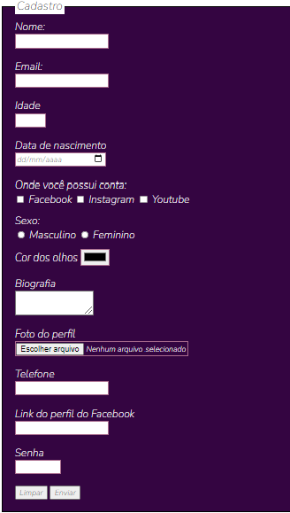

# 2-desafio-formulario-html
>  Third project in Html e CSS

 Projeto para treino e teste de aula em HTML e CSS

## 🚀 Technologies

Esse projeto foi desenvolvido com as seguintes tecnologias:

- HTML5
- CSS 3

## 🤝 Colaboradores

Agradecemos às seguintes pessoas que contribuíram para este projeto:

<table>
  <tr>
    <td align="center">
      <a href="#">
         
        
          <b>Zenith Carla</b>
        
      </a>
    </td>
  </tr>
</table>

